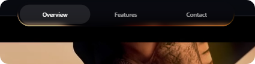

- npm i @7sadakonr/lumanav

# Lumanav - Glass Navbar Demo

Lumanav is a modern, responsive navigation bar featuring a sleek glassmorphism design. Built with React, TypeScript, and Vite, it provides a beautiful and interactive user interface component suitable for modern web applications.

## 📸 Preview



## ✨ Features

- **Glassmorphism Design**: Semi-transparent background with background blur effect.
- **Responsive Layout**: Adapts seamlessly to different screen sizes.
- **Smooth Animations**: Interactive hover effects and transitions.
- **Modern Tech Stack**: Built using React, TypeScript, and Vite for fast development and optimal performance.

## 🚀 Getting Started

### Prerequisites

- Node.js (v18 or higher recommended)
- npm, yarn, or pnpm

### Installation

1. Clone the repository:
   ```bash
   git clone https://github.com/7sadakonr/Lumanav.git
   ```

2. Navigate to the project directory:
   ```bash
   cd Lumanav
   ```

3. Install dependencies:
   ```bash
   npm install
   ```

4. Start the development server:
   ```bash
   npm run dev
   ```

## 🛠️ Built With

- [React](https://reactjs.org/)
- [TypeScript](https://www.typescriptlang.org/)
- [Vite](https://vitejs.dev/)
- Vanilla CSS (for styling and animations)

